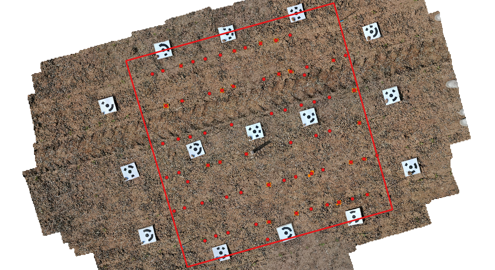

# Beet Segmentation

**Sugar beet plant segmentation and counting using YOLOv6 deep learning algorithms.**

## Introduction
This project was done within the course "Machine Learning and Deep Learning for
Geographic Applications" at the Institute of Geography at Heidelberg University during the Winterterm of 2023/2024. 
  
Sugar beet cultivation plays a significant role in modern agricultural practices in several regions in europe, necessitating precise management strategies to optimize yield and profitability. Central to this optimization is the accurate counting of sugar beet plants within cultivated fields directly after emergence, a task traditionally performed through labor-intensive manual methods. However, advancements in technology, particularly in the realm of deep learning and image analysis, offer promising alternatives to streamline this process. Such an approach provides valuable insights into the quantity and spatial distribution of individual plants, empowering farmers to make better informed decisions.

This project aims to provide a python program to extract and count single sugar beet plants based on deep learning methods. We use a YOLOv6 algorithm trained on custom dataset for plant segmentation. Counting and geographical processing is done afterwards, geometries are returned in GeoJSON format. The figure below shows a single sugar beet plant to give some impression on growing stage and model application. To run the program follow the given instructions.


## Installation

### 1. Download repository

```
$ git clone https://github.com/PhilippFriedrich/beet-segmentation.git   
$ cd beet-segmentation
```

### 2. Create environment

After cloning the repository you should create an environment containing the needed packages. We recomend using conda for managing python packages. 

```
$ conda create -n beet-segmentation python=3.10    
$ conda activate beet-segmentation
```

## Usage

Within the created environment the program can be executed. It is designed to run from the command line. The user must provide a orthophoto or georeferenced image as GeoTIFF for wich the analysis is done. Moreover an area of interest can be used by the program. The polygon needs to be in GEOJSON format. If no area of interest is provided, the program will count all plant on the image. The program can be executed as follows:

```
$ python main.py arg1 arg2
```

If you want to change the folder structure or run the program within a IDE, you may need to adjust filepaths and inputs.

### Arguments

Two Arguments must be provided:
- **arg1** - Path to your orthophoto or georeferenced image
- **arg2** - Area of interest to count number of plant and plant density

### Output  
The program creates an output folder if it doesn't already exist. Within this output folder a new folder is created containing the place name, the betweenness centrality method, the route type and the number of routes. The following files are stored in the folder: 
- **Plant points as GeoJSON** Point representation of the single plant.
- **Plant bounding boxes as GeoJSON** Polygon representation of the single plant bounding boxes.

The results will be stored in the results folder of the project.

## Model training and implementation

We used a custom dataset to train YOLOv6 algorithm. The final model is stored [here](YOLOv6/runs/detect/train/weights/). In case you want to train the algorithm with your own dataset you can replace the custom_dataset inside the YOLOv6 directory with your own dataset. You may follow the instructions in this [Jupyter Notebook](src/jupyter_notebooks/beet_segmentation_data.ipynb) for data preprocessing and labeling. Afterwards you can run this [Python Script](src/model_training/train.py) to train the model. Adjust the number of epochs to your custom needs.

**Label tool:**  
https://www.makesense.ai/  
To safe progress follow these steps:  
1. Export labels as VOC xml (zip file has to be unpacked after download)  
2. Import labels as VOC xml  

Additionally we provide some Notebooks for [Model Training using Google Colab](src/jupyter_notebooks/beet_segmentation_model.ipynb) and also for [Insights into Data Postprocessing](src/jupyter_notebooks/beet_segmentation_application.ipynb). You may have a look in case you are interested.

## Example

```
$ cd beet-segmentation/src  
$ python main.py path/to/field1_orthomosaic_UTM32N.tif ../data/study_area/sb_field_1_area.geojson
```
This example will detect the single sugar beet plants on the provided orthophoto (field1_orthomosaic_UTM32N.tif) and extract point and bounding box geometries inside the area polygon (sb_field_1_area.geojson). The geometries are exported in GeoJSON format.



Restult:

```
-----------------------------------
-----------------------------------
Number of beets detected in area of interest: 69
Plant density in area of interest: 7.76 plants/m²
-----------------------------------
-----------------------------------
```

 ## Support
- an301@uni-heidelberg.de
- wk279@uni-heidelberg.de

## Contributing
Contributers welcome.

## Authors and acknowledgment
Contributing authors of the project are Gustav Schimmer (an301@uni-heidelberg.de) & Philipp Friedrich (wk279@uni-heidelberg.de).

## License
The project is licensed under GNU General Public License Version 3 or later, for details see [LICENSE](LICENSE.txt) file.

## Project status
Under developement.

## Notes
If you have questions or encounter any problems or improvements running the code, feel free to get in touch with us!


